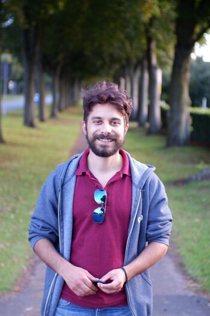

Hi there, 👋👋
I'm Nikos,

 

<!--

-->

---

I'm a Robotics Product Engineer, currently situated in London, working for a
cool startup called @slamcore.

- 🛠 I’m working on Open-Source Robotics, Automation tools, [Anki](https://apps.ankiweb.net/), [Albert](https://albertlauncher.github.io/), [Vim](https://www.vim.org/) plugins, and lots more!
- 📖 I’m currently learning about [Rust](https://www.rust-lang.org/), 🦀, Embedded Systems, Photography, Spanish 🇪🇸,
- 📢 Ask me about my Linux setup 🐧
- 💬 Pronouns: He/Him

## Stats

